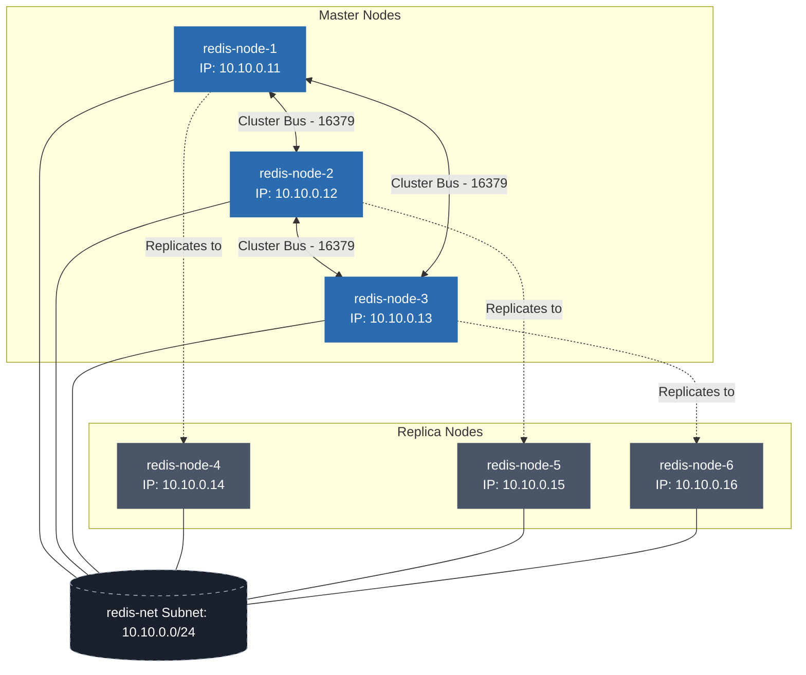

# Redis Cluster Deployment Assignment

This project provides a multi-node Redis Cluster orchestrated using Docker Compose and automated using Ansible.

## 1. Project Structure

The project layout is structured as follows:
*   [infra/](file:///home/pain/Documents/zohoassignment/submission/infra/): Infrastructure definitions
    *   [compose.yml](file:///home/pain/Documents/zohoassignment/submission/infra/compose.yml): Launches 6 containers on a custom network.
    *   [Dockerfile](file:///home/pain/Documents/zohoassignment/submission/infra/Dockerfile): Defines the SSH-enabled Ubuntu base image for the Redis nodes.
    *   [id_rsa](file:///home/pain/Documents/zohoassignment/submission/infra/id_rsa) / [id_rsa.pub](file:///home/pain/Documents/zohoassignment/submission/infra/id_rsa.pub): SSH keys for passwordless automation access.
*   [ansible/](file:///home/pain/Documents/zohoassignment/submission/ansible/): Ansible configuration & plays for automated provisioning.
*   [output/](file:///home/pain/Documents/zohoassignment/submission/output/): Captured terminal executions and verification outputs.
*   [redis_cluster_architecture.png](file:///home/pain/Documents/zohoassignment/submission/redis_cluster_architecture.png): Visual topology diagram.

---

## 2. Container Network & Node Configuration

All nodes are connected to a dedicated bridge network `redis-net` on subnet `10.10.0.0/24`.

| Service Name | Hostname | IP Address | Host SSH Port | Host Redis Port | Cluster Role |
| :--- | :--- | :--- | :--- | :--- | :--- |
| `redis-node-1` | `redis-node-1` | `10.10.0.11` | `2201` | `6371` | **Master 1** |
| `redis-node-2` | `redis-node-2` | `10.10.0.12` | `2202` | `6372` | **Master 2** |
| `redis-node-3` | `redis-node-3` | `10.10.0.13` | `2203` | `6373` | **Master 3** |
| `redis-node-4` | `redis-node-4` | `10.10.0.14` | `2204` | `6374` | **Replica 1** (backup of Node-1) |
| `redis-node-5` | `redis-node-5` | `10.10.0.15` | `2205` | `6375` | **Replica 2** (backup of Node-2) |
| `redis-node-6` | `redis-node-6` | `10.10.0.16` | `2206` | `6376` | **Replica 3** (backup of Node-3) |

---

## 3. Logical Topology (Mermaid)

---

## 4. Visual Topology Diagram

