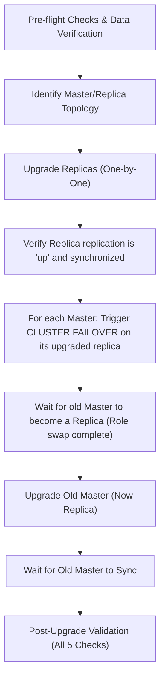

# Redis Cluster Lifecycle Management Tool

An automated CLI tool (`redis-tool`) that wraps Ansible playbooks to provision, seed, monitor, scale, and perform zero-downtime rolling upgrades or rollbacks on a Redis Cluster running in containerized nodes.

---

## 1. Bringing Up the Container Infrastructure

The simulated cluster runs inside Ubuntu 22.04 containers with a pre-configured SSH server. The architecture is designed to support either **Docker** or **Podman** seamlessly.

### Network Architecture
- **Subnet**: Static bridge network `10.10.0.0/24` (`redis-net`)
- **Containers & IPs**:
  - `redis-node-1` to `redis-node-6` map to `10.10.0.11` to `10.10.0.16` (initial cluster)
  - `redis-node-7` and `redis-node-8` map to `10.10.0.17` and `10.10.0.18` (used for scale-out)
- **Local Port Mapping**:
  - **SSH**: Ports `2301-2308` on localhost map to port `22` on the respective containers.
  - **Redis**: Ports `6471-6478` on localhost map to port `6379` on the respective containers.
- **SSH Authentication**: Uses a pre-generated SSH private key (`infra/id_rsa`) on the host mapping to `authorized_keys` inside the containers.

### Launch Instructions

To simplify startup and security, an automated launcher script `up.sh` is provided in the `infra/` directory. On its first execution, it automatically generates a new secure SSH key pair (`id_rsa` and `id_rsa.pub`) in the `infra/` directory if they do not exist. It then automatically detects your running container engine (Docker or Podman) and builds/starts the infrastructure.

1. Navigate to the infrastructure directory:
   ```bash
   cd infra/
   ```
2. Run the automated launcher script:
   ```bash
   ./up.sh
   ```

Alternatively, you can manually build/start the containers (ensure SSH keys `id_rsa` and `id_rsa.pub` exist in the `infra/` directory first):
- **Using Docker**: `docker compose up -d --build`
- **Using Podman**: `podman-compose up -d --build` or `podman compose up -d --build`

This launches the 6 initial container nodes (and defines services for nodes 7 & 8 so they can be brought up dynamically during scaling operations).


---

## 2. Running `redis-tool` CLI Commands

The CLI tool includes an automatic **Prerequisite Check** before executing any command. It validates:
- The presence of a running container engine (Docker or Podman) matching your environment configuration.
- The installation of Ansible on the host machine with version $\ge$ 2.14.

### Basic Syntax
```bash
python3 redis-tool <command> [arguments]
```

### Reference for Each Command

#### Command 1: `provision`
Compiles Redis from source, configures the configurations for cluster mode, starts the Redis services, and initializes the topology.
```bash
python3 redis-tool provision [--version VERSION] [--masters MASTERS] [--replicas-per-master REPLICAS]
```
- **Arguments**:
  - `--version`: The Redis version release tag to deploy (default: `7.0.15`).
  - `--masters`: Number of master nodes to create (default: `3`).
  - `--replicas-per-master`: Number of replicas assigned to each master node (default: `1`).
- **Behavior**: Compiles the specified Redis version, sets up custom directories, binds interfaces, starts `redis-server` in daemon mode, executes cluster creation (`redis-cli --cluster create`), and prints the resulting topology.

#### Command 2: `status`
Inspects and displays real-time health, topology, and performance metrics of the cluster.
```bash
python3 redis-tool status
```
- **Output**: Shows the `cluster_state`, node list, master/replica roles, slot allocations, key count per master, and memory utilization.

#### Command 3: `data seed`
Populates the cluster with a specified number of deterministic key-value pairs for testing.
```bash
python3 redis-tool data seed [--keys KEYS]
```
- **Arguments**:
  - `--keys`: The number of keys to generate and seed (default: `1000`).
- **Behavior**: Inserts keys in the format `key:XXXX` where the value is the SHA-256 hash of the key string. It stores the total count under `metadata:num_keys` in the cluster for future automated validation.

#### Command 4: `data verify`
Validates that the seeded data can be retrieved from the cluster and that key routing functions correctly.
```bash
python3 redis-tool data verify [--keys KEYS]
```
- **Arguments**:
  - `--keys`: Number of keys to verify. If omitted, the tool queries `metadata:num_keys` from the cluster, defaulting to `1000` if the key is missing.
- **Behavior**: Retrieves each key, re-calculates the expected SHA-256 hash, and reports a PASS/FAIL summary showing insertion locations, missing keys, or mismatched values.

#### Command 5: `verify`
Performs checks on the cluster topology, health, and data consistency.
```bash
python3 redis-tool verify [--full] [--keys KEYS]
```
- **Arguments**:
  - `--full`: Run a comprehensive multi-layer validation suite.
  - `--keys`: Number of keys to verify during the data integrity phase (default: `1000`).
- **Behavior (Without `--full`)**: Runs a standard `redis-cli --cluster check` and `redis-cli cluster info` displaying the output.
- **Behavior (With `--full`)**: Runs 5 verification checks:
  1. **Data Integrity**: Verifies hash matches on all seeded keys.
  2. **Version Consistency**: Checks that all active nodes are running the exact same version of Redis.
  3. **Topology Health**: Asserts all 16,384 slots are covered and each master node has at least one active replica.
  4. **Cluster State**: Confirms cluster state reports `ok`.
  5. **Replication Link Status**: Asserts `master_link_status:up` across all replica nodes.

#### Command 6: `upgrade`
Performs a zero-downtime rolling upgrade of all cluster nodes to a target version.
```bash
python3 redis-tool upgrade --target-version VERSION [--strategy STRATEGY] [--keys KEYS]
```
- **Arguments**:
  - `--target-version`: Target version tag to upgrade to (default: `7.2.6`).
  - `--strategy`: Upgrade mode to use (default/only choice: `rolling`).
  - `--keys`: Number of keys to check during baseline/post-flight verifications.
- **Behavior**: Performs a pre-flight health assessment, backs up data, upgrades all replicas first, executes coordinated master failovers to shift active traffic, upgrades the old master nodes, and performs final verification.

#### Command 7: `scale`
Scales the cluster out (adding nodes) or in (removing nodes).
```bash
# Scale Out
python3 redis-tool scale --add-nodes 2

# Scale In
python3 redis-tool scale --remove-node <NODE_ID>
```
- **Arguments**:
  - `--add-nodes`: Number of nodes to add. Must be `2` (starts containers `redis-node-7` and `redis-node-8`, detects running cluster version, configures them, joins them, and performs a rebalance).
  - `--remove-node`: Node ID of the master node to scale down.
- **Behavior (Scale Out)**: Spins up node 7 (master) and node 8 (replica of 7) containers, compiles matching cluster Redis version, registers them to the cluster network, and triggers `--cluster-use-empty-masters` rebalancing.
- **Behavior (Scale In)**: Discovers the target master and its replica. Migrates/reshards all hash slots belonging to the target master to a healthy destination master. Removes the replica first, then deletes the master node from the cluster, and terminates their Redis instances.

#### Command 8: `rollback`
Reverts the cluster nodes to a specified older version.
```bash
python3 redis-tool rollback --target-version VERSION [--keys KEYS]
```
- **Arguments**:
  - `--target-version`: Redis version tag to rollback to (default: `7.0.15`).
  - `--keys`: Keys to verify after the rollback.
- **Behavior**: Discovers cluster topology, stops Redis services, restores compatible `dump.rdb` and `appendonlydir` backups from `/var/lib/redis-backup/` (if present), cleans up incompatibilities in `nodes.conf`, installs target binary, starts the nodes, and verifies replication and data.

---

## 3. Rolling Upgrade Strategy: Zero Client-Visible Downtime

Upgrading a live Redis Cluster without causing client-visible downtime requires an ordered sequence of replica upgrades followed by coordinated failovers. The strategy implemented in the upgrade playbook is detailed below:



### Step-by-Step Mechanism

1. **Pre-flight Check & Backup**:
   - Asserts that `cluster_state:ok` and all nodes are online.
   - Runs a data verification check to establish a baseline.
   - Triggers `SAVE` on all nodes and backs up the databases (`dump.rdb` and `appendonlydir`) into `/var/lib/redis-backup/`.
2. **Replica Upgrades (Replica-First)**:
   - Upgrades replica nodes one-by-one (`serial: 1`).
   - Replicas do not serve slot traffic directly under standard write operations, so taking them down for compilation and upgrade does not cause client write failures.
   - Once a replica is compiled and restarted, the playbook waits until `master_link_status:up` is reported, ensuring it has synchronized with its master before moving to the next node.
3. **Coordinated Master Failover**:
   - For each master node, the playbook delegates a command to its upgraded replica: `redis-cli CLUSTER FAILOVER`.
   - This initiates a coordinated failover. The master and replica swap roles. The replica is promoted to master, and the old master demotes itself to a replica. This role swap is completed with zero client-visible downtime.
4. **Old Master Upgrades**:
   - Now that the old master node has safely transitioned to a replica, it can be taken down, compiled with the target version, and restarted.
   - The playbook waits for the upgraded node (now a replica) to sync back up with its master.
5. **Format Compatibility (`nodes.conf` Parser)**:
   - *Challenge*: Redis 7.2+ changes the `nodes.conf` format by appending hostname details separated by commas (e.g. `10.10.0.11:6379@16379,redis-node-1`). If a cluster is in a mixed-version state, or if a node is rolled back to a pre-7.2 version (such as 7.0.x), older versions fail to parse this formatting and crash.
   - *Solution*: The playbook injects an inline Python parser that sanitizes `/var/lib/redis/nodes.conf` by stripping the comma-appended hostname values from the IP address mapping before startup, guaranteeing backward compatibility.

---

## 4. Assumptions & Trade-offs

*   **Port Relocation**:
    - *Assumption*: Standard host ports `2201-2206` (SSH) and `6371-6376` (Redis) might collide with active system engines or local firewalls.
    - *Trade-off*: Shifted local SSH mapping ports to `2301-2308` and Redis ports to `6471-6478`. This ensures no port collisions on the host, but requires custom client routing configurations.
*   **Compilation from Source**:
    - *Assumption*: Building Redis from source code directly on target nodes ensures consistency across arbitrary version choices (e.g. minor patch releases).
    - *Trade-off*: Compiling from source increases the time footprint of provisioning, upgrades, and rollbacks. However, it ensures exact binary compatibility without relying on external APT repositories.
*   **SSH Fingerprint Verification Bypassed**:
    - *Assumption*: Containers are rebuilt and assigned identical IPs frequently during development.
    - *Trade-off*: Configured `UserKnownHostsFile=/dev/null` and `StrictHostKeyChecking=no` in Ansible vars. This allows headless orchestration without interactive prompts, at the cost of bypassing host-key verification inside this isolated subnet.

---

## 5. Known Limitations

*   **No Auto-Rollback on Playbook Failures**: If an upgrade task fails midway (e.g., due to compile errors or synchronization timeouts), the playbook halts immediately. It does not auto-rollback, leaving the cluster in a mixed-version state. The operator must run `rollback` or perform manual remediation.
*   **Hardcoded Subnet & Name Mappings**: The script uses a hardcoded mapping between container IPs (`10.10.0.11`-`18`) and inventory hostnames (`redis-node-1`-`8`). Modifying the subnet or altering container names requires manual updates to the Ansible playbooks and inventory file.
*   **Single-Threaded Upgrades**: The playbooks run node upgrades sequentially (`serial: 1`) to preserve cluster quorum and availability. While safe, this increases the total upgrade execution time on large clusters.
*   **Backup Storage Limitations**: DB backups are stored locally on each container node at `/var/lib/redis-backup/`. If a container is deleted or pruned (rather than stopped), these backups will be lost unless volume mounts are established.
